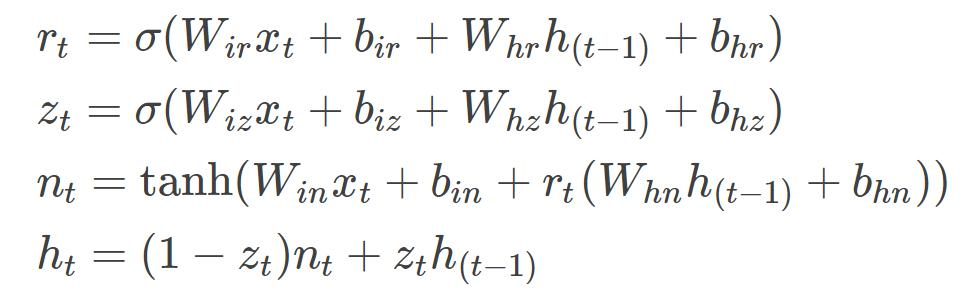

## 作业三：循环神经网络

by Charles

### 前言

利用 PyTorch，本作业实现了一个基于word embedding和GRU的语言模型（Language Model，以下简称LM）。其包括一个encoder层、一个GRU层和一个decoder层，embedding维度与GRU的hidden state维度均为1500，采用了自己搭建的带有Layer Normalization（LN）的GRU模块，运用了dropout、学习初始状态、锁定encoder与decoder参数、梯度裁剪等技巧来提升模型性能，最终在测试集上模型的perplexity (PP)值为89.52，所得模型大小约为108M。本报告将从模型搭建、模型训练、测试方法等方面对本作业的工作进行详细说明。

作业所有代码以及训练好的模型存放于 hw3\_language\_model\_handed 文件夹中。参考借鉴 Pytorch 的构建LM的官方教程1及作业启动代码，本作业代码的组织结构如下表所示：

| 代码文件 | 功能 |
| --- | --- |
| prepare\_data.py | 根据任务类型（训练或是测试），获得相应的语料库 |
| modules.py | 构建带LN的GRU模块及对其进行测试 |
| build\_model.py | 根据选定的参数构建语言模型 |
| main.py | 主程序。包含了训练与测试代码，可从命令行接受参数输入。 |

### 模型搭建
#### 思路分析

模型计算图的构建由 build\_model.LMModel类完成。根据课上所学及一些博客所分享的NLP最佳实践2，本作业模型设计的主要思路如下：

1. 在各种神经网络中，RNN最适合对序列进行建模，但是为缓解梯度消失、梯度爆炸的问题，使网络可以得到训练，需要选用LSTM或者GRU。一般而言两者在精度上区别不大，LSTM更容易过拟合，GRU则收敛更快。GRU正变得越来越流行。
2. 在纵向堆叠RNN模块可以得到深度RNN网络，其建模能力更强，但也更难训练，目前深度一般最多不超过五层。对RNN单元做Layer Normalization（LN）可以加快RNN网络的训练，同时提高其泛化能力。
3. 在对单词做特征表示时，word embedding方法能度量不同单词的相似程度，在NLP问题中比词袋法效果更好。
4. dropout、学习初始状态、锁定encoder与decoder参数、梯度裁剪等技巧可以使模型更容易被训练，同时提高模型的精度。

#### GRU的实现

在modules.py中，首先实现了LayerNormGRUCell类。在torch.nn.GRUCell中，重置门r、更新门z、输出门n和隐状态h的基本更新公式如下所示，本作业在其基础上引入了新的可训练参数对重置门r输出和更新门z输出的正则化。为提高效率，公式中的所有矩阵运算都直接调用torch.mm完成。

    

为构建多层的GRU网络，本作业进一步将LayerNormGRUCell封装在了LayerNormGRUCellModule中，以便借助torch.nn.ModuleList容器管理多个GRU Cell。最后在LayerNormGRU类中，程序利用一个for循环构建起多层的GRU网络，并对非最后一层输出进行正则化。总结来说，用户可通过LayerNormGRU(input\_size, hidden\_size, nlayers, dropout=0.0, bias=True, layer\_norm=False)类来建立带LN、dropout的多层GRU。

modules.py中还包含了LayerNormGRUCellTest()和LayerNormGRUTest()两个测试函数，通过分别与torch.nn.GRUCell 和torch.nn.GRU输出结果的对比，验证了LayerNormGRUCell和LayerNormGRU输出的正确性。值得注意的是，由于PyTorch中并没有实现带LN的GRU模块，因此验证代码并没有验证自己搭建的模块带LN功能时的正确性。但从实际试验中LN功能带来的效果提升来看，代码中的实现是可靠的。

### 模型训练
#### 数据预处理

数据预处理（即语料库的生成）由prepare\_data.Corpus类完成。该类提供两个模式：train和test。在train模式下，程序首先读入train.txt，建立并持久化保存一个word to id的字典，然后将trian.txt和valid.txt中的单词都替换成该单词对应的id，得到一个表示该文档的特征向量。随后依据给定的batch size，将该向量整理成矩阵形式（矩阵列数等于batch size）。经过处理后，不同列之间将失去依赖关系，损失极小部分的训练数据。test模式下的数据处理与train模式类似，只不过此时程序将直接读入已保存好的word to id词典，为test文档建立数据矩阵。

在训练或者测试过程中，main.get\_batch()函数将从语料库中获取相应位置、相应长度的序列，以供输入到网络中。本作业中将序列的长度定为35，即认为当前时刻的单词是什么最多与之前的35个单词有关系。合理设置该长度将有利于模型的训练与精度的提升。

#### 训练方法与参数调优

本作用通过main.train()来完成单个epoch的训练，通过 main.train\_main()来完成多个epoch的循环，并在其中动态地调整学习率与batch size，还能根据验证集pp的情况提前结束训练。训练采用adam优化器，开始训练时，为给梯度下降提供更多的随机性，采用较小的batch size，并逐步增大batch size到一定的值，之后保持该batch size一直训练下去。实践证明这种动态调整batch size的方法在本任务中能带来一定的性能提升。另外，当验证集pp陷入停滞时，验证集将降低为原来的一半；当连续停滞次数超过一定的阈值时，模型训练将终止。

下面一系列表格记录了本作业中参数调优的过程。其中所涉及到的参数解释如下：

- model表示所使用的RNN网络类型
- ninp表示word embedding的向量维度
- nhid表示RNN网络输出的维度
- tie参数为选择是否锁定encoder与decoder参数，当其为true时， ninp与nhid必须设置为相同的值
- layer\_norm参数为是否使用LN

表1：LSTM与GRU性能比较

| 实验编号 | model | ninp/nhid | nlayers | tied | batch size | train speed（ms/batch） | val pp |
| --- | --- | --- | --- | --- | --- | --- | --- |
| 1 | LSTM | 1500/1500 | 2 | true | 20 | 254.99 | 95.94 |
| 2 | GRU | 1500/1500 | 2 | true | 20 | 207.87 | 98.98 |

由上表可知，LSTM的精度比GRU更好一些，但差别不大；由于参数较少，GRU比LSTM的训练速度更快一些。处于GRU正变得越来越流行的考虑，接下来将基于GRU进行参数调优，并始终将tied设置为true。

表2：batch size对模型的影响

| 实验编号 | ninp/nhid | nlayers | batch size | val pp |
| --- | --- | --- | --- | --- |
| 3 | 1500/1500 | 2 | 固定为100 | 94.74 |
| 4 | 1500/1500 | 固定为256 | 94.64 |
| 5 | 1500/1500 | 从20开始，增长到200 | 93.18 |
| 6 | 1500/1500 | 从10开始，增长到384 | 99.30 |

 通过比较实验2、3、4，可知本任务的最佳batch size在200左右，比较实验4、5、6，可知采取动态调整batch size的方式有助于提升模型精度，但过大的batch size则会损害模型精度。接下来的表中若无特别说明，都将将采用实验5所确定的batch size调整策略，

表3：Embedding 维度、隐状态维度、初始状态学习对模型的影响

| 实验编号 | ninp/nhid | nlayers | 初始状态学习 | val pp |
| --- | --- | --- | --- | --- |
| 7 | 1500/1500 | 1 | false | 91.43 |
| 8 | 750/750 | 1 | false | 92.38 |
| 9 | 1000/1000 | 2 | false | 91.98 |
| 10 | 1000/1000 | 3 | false | 96.16 |
| 11 | 1000/1000 | 2 | true | 91.46 |
| 12 | 1500/1500 | 1 | true | 90.18 |

通过比较实验5、7及比较实验9、10，可发现单层网络对本任务效果最好；通过比较实验9、11及比较实验7、12，可发现对网络的初始状态也进行学习能够提升一些性能。接下来的表中若无特别说明，都将ninp与nhid都设为1500，nlayers设为1，并将初始状态学习设置为true。

表4：使用自己搭建的GRU、层正则化（LN）对模型的影响

| 实验编号 | nlayers | GRU来源 | layer\_norm | val pp |
| --- | --- | --- | --- | --- |
| 13 | 1 | 自己搭建 | false | 92.12 |
| 14 | 1 | 自己搭建 | true | 89.52 |
| 15 | 2 | 自己搭建 | true | 91.04 |

通过比较实验12、13，可发现采用自己搭建的GRU比采用PyTorch原生的GRU在精度上要差一些；通过比较实验13、14，可发现LN确实能提升一点模型的精度；通过比较实验14、15，可发现在使用LN的情况下，两层GRU的效果仍然不如单层GRU，这可能是由于两层GRU仍然没有得到充分的训练、未能找到全局最优参数所造成的。

综上所述，经过参数调优，最终模型使用自己搭建的GRU模块，ninp与nhid均为1500，nlayers为1，embedding向量的dropout设为0.5，使用动态调整batch size、锁定encoder与decoder参数、使用层正则化。最终所得模型在验证集上的pp为89.52。

### 测试命令

由作业所提供的train.txt生成的word to id词典已保存为./data/pta/word\_id.pkl。当测试用txt文档所用的单词没有超出词典范围时，可进入hw3\_language\_model 文件夹，通过以下命令计算测试集的pp：

python main.py --mode test --cuda --gpu\_id 0 --test\_file /path/to/test/file

### 总结

经过一系列的模型结构优化、参数调试，所提出的模型在验证集上的perplexity由最初的98.98 左右提高到了最终的89.52 左右，现将相关经验总结如下：

1. LSTM与GRU的精度大致相同，但GRU的收敛速度和训练速度更快一些。一般而言，LSTM模型更复杂，更适合大数据集；而GRU则更适合小数据集，因为它没那么复杂，从而有助于减少过拟合。
2. word embedding方法能对单词之间的相似性进行度量，所以用它对单词进行表示的效果更好。
3. RNN网络中要预测下一个词时，都需要显式或者隐式地依赖与模型的初始状态。如果将该初始状态设置为可学习的参数而不是随机生成的变量，则可以略微提高模型的精度。
4. 由于NLP任务中的单词表往往很大，因此单词表示具有很大的稀疏性，给encoder的训练带来了一定的困难。如果将encoder的参数与decoder参数联系起来，那么这些参数将有机会利用更多的样本进行训练，从而得到更好的特征表示。
5. Layer Normalization是仿照CNN网络中的Batch Normalization而提出来的，它能减少一个样本中模型某一层输出的covariate shift，在一定程度上使得模型的训练速度加快，泛化能力增强。